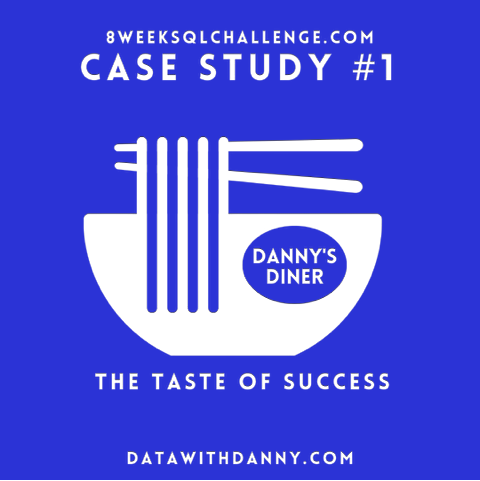
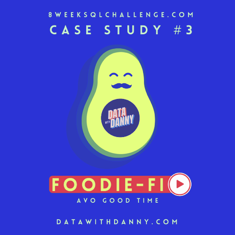

# Data Problems

## Table of Contents

- [Motivation](#motivation)
- [Setup](#setup)
- [Case Studies](#case-studies)

## Motivation

## Setup

## Case Studies

### 1. Danny's Diner

    

Danny seriously loves Japanese food. At the beginning of 2021, he decided to open up a restaurant that sells his 3 favourite foods: sushi, curry and ramen.

Danny’s Diner is in need of your assistance to help the restaurant stay afloat. The restaurant has captured some data from their few months of operation, but have no idea how to use data to help them run the business.

### 2. Pizza Runner

    

Danny was scrolling through his feed when something really caught his eye - “80s Retro Styling and Pizza Is The Future!”. Danny was sold on the idea, and he had one more genius idea to combine with it. He was going to Uberise it, and so Pizza Runner was launched!

Danny was very aware that data collection was going to be critical for his business growth. He has prepared data for us, but required further assistance to clean the data and apply some calculations, so that he can better direct his runners and optimise Pizza Runner’s operations.

### 3. Foodie-Fi

    

Danny found a few smart friends to launch his new startup Foodie-Fi in 2020. He started selling monthly and annual subscriptions giving their customers unlimited on-demand access to exclusive food videos from around the world - think something like Netflix but with only cooking shows!

Danny created Foodie-Fi with a data-driven mindset. He wanted to ensure all future investment decisions and new features were decided using data. This case study focuses on using subscription-style data to answer important business questions.

