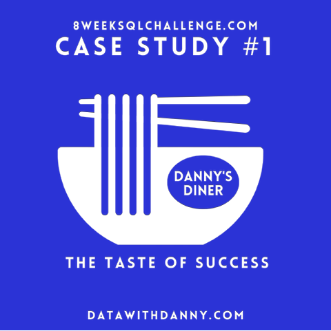

# Danny's Diner

    

## Table of Contents

- [Context](#context)
- [Goals](#goals)
- [Data](#data)
- [Questions](#questions)

## Context

Danny seriously loves Japanese food. At the beginning of 2021, he decided to open up a restaurant that sells his 3 favourite foods: sushi, curry and ramen.

Danny’s Diner is in need of your assistance to help the restaurant stay afloat. The restaurant has captured some data from their few months of operation, but have no idea how to use data to help them run the business.

## Goals

Danny wants to use this data to answer a few questions about his customers. Having this deeper understanding will help him deliver a better, more personalised experience for his loyal customers. He also plans on using these insights to help him decide whether he should expand the existing customer loyalty program. 

Additionally, he needs help to generate some datasets, so his team can easily inspect the data without needing to use SQL.

## Data

### sales

The `sales` table captures all `customer_id` level purchases with corresponding `order_date` and `product_id` information for when and what menu items were ordered.

| customer_id | order_date | product_id |
|-------------|------------|------------|
| A           | 2021-01-01 | 1          |
| A           | 2021-01-01 | 2          |
| A           | 2021-01-07 | 2          |

### menu

The `menu` table maps `product_id` to the actual `product_name` and `price` of each menu item.

| product_id | product_name | price |
|------------|--------------|-------|
| 1          | sushi        | 10    |
| 2          | curry        | 15    |
| 3          | ramen        | 12    |

### members

The `members` table captures `join_date` when a `customer_id` joined the beta version of Danny’s Diner loyalty program.

| customer_id | join_date  |
|-------------|------------|
| A           | 2021-01-07 |
| B           | 2021-01-09 |

## Questions

1. What is the total amount each customer spent at the restaurant?
2. How many days has each customer visited the restaurant?
3. What was the first item from the menu purchased by each customer?
4. What is the most purchased item on the menu? How many times was it purchased by all customers?
5. Which item was the most popular for each customer?
6. Which item was purchased first by the customer after they became a member?
7. Which item was purchased just before the customer became a member?
8. What is the total items and amount spent for each member before they became a member?
9. If each $1 spent equates to 10 points and sushi has a 2x points multiplier, how many points would each customer have?
10. In the first week after a customer joins the program (including their join date), they earn 2x points on all items, not just sushi. How many points do customer A and B have at the end of January?
11. Recreate the following table output using the available data

| customer_id | order_date | product_name | price | member |
|-------------|------------|--------------|-------|--------|
| A           | 2021-01-01 | curry        | 15    | N      |
| A           | 2021-01-01 | sushi        | 10    | N      |
| A           | 2021-01-07 | curry        | 15    | Y      |
| A           | 2021-01-10 | ramen        | 12    | Y      |
| A           | 2021-01-11 | ramen        | 12    | Y      |
| A           | 2021-01-11 | ramen        | 12    | Y      |
| B           | 2021-01-01 | curry        | 15    | N      |
| B           | 2021-01-02 | curry        | 15    | N      |
| B           | 2021-01-04 | sushi        | 10    | N      |
| B           | 2021-01-11 | sushi        | 10    | Y      |
| B           | 2021-01-16 | ramen        | 12    | Y      |
| B           | 2021-02-01 | ramen        | 12    | Y      |
| C           | 2021-01-01 | ramen        | 12    | N      |
| C           | 2021-01-01 | ramen        | 12    | N      |
| C           | 2021-01-07 | ramen        | 12    | N      |

12. Danny also requires further information about the `ranking` of customer products, but he purposely does not need the ranking for non-member purchases. He expects NULL ranking values for the records when customers are not yet part of the loyalty program.

| customer_id | order_date | product_name | price | member | ranking |
|-------------|------------|--------------|-------|--------|---------|
| A           | 2021-01-01 | curry        | 15    | N      | NULL    |
| A           | 2021-01-01 | sushi        | 10    | N      | NULL    |
| A           | 2021-01-07 | curry        | 15    | Y      | 1       |
| A           | 2021-01-10 | ramen        | 12    | Y      | 2       |
| A           | 2021-01-11 | ramen        | 12    | Y      | 3       |
| A           | 2021-01-11 | ramen        | 12    | Y      | 3       |
| B           | 2021-01-01 | curry        | 15    | N      | NULL    |
| B           | 2021-01-02 | curry        | 15    | N      | NULL    |
| B           | 2021-01-04 | sushi        | 10    | N      | NULL    |
| B           | 2021-01-11 | sushi        | 10    | Y      | 1       |
| B           | 2021-01-16 | ramen        | 12    | Y      | 2       |
| B           | 2021-02-01 | ramen        | 12    | Y      | 3       |
| C           | 2021-01-01 | ramen        | 12    | N      | NULL    |
| C           | 2021-01-01 | ramen        | 12    | N      | NULL    |
| C           | 2021-01-07 | ramen        | 12    | N      | NULL    |

