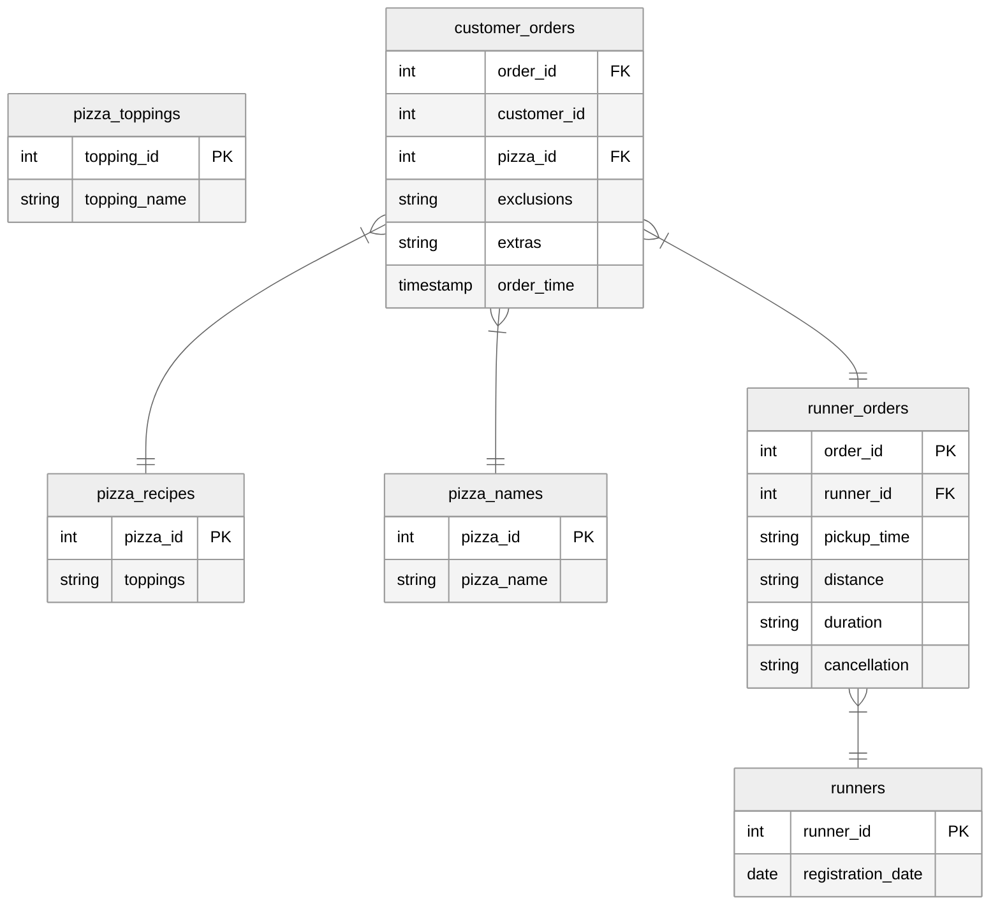

# Pizza Runner

    

## Table of Contents

- [Context](#context)
- [Goals](#goals)
- [Data](#data)
- [Questions](#questions)

## Context

Danny was scrolling through his feed when something really caught his eye - “80s Retro Styling and Pizza Is The Future!”. Danny was sold on the idea, and he had one more genius idea to combine with it. He was going to Uberise it, and so Pizza Runner was launched!

He started by recruiting “runners” to deliver fresh pizza from Pizza Runner HQ (otherwise known as Danny’s house). He also maxed out his credit card to pay freelance developers to build a mobile app to accept orders from customers.

## Goals

Danny was very aware that data collection was going to be critical for his business growth. He has prepared data for us, but required further assistance to clean the data and apply some calculations, so that he can better direct his runners and optimise Pizza Runner’s operations.

## Data

### customer_orders

Customer orders are captured in the `customer_orders` table with 1 row for each individual pizza that is part of the order.

`exclusions` are `topping_id` values that need to be removed from the pizza. 

`extras` are `topping_id` values that need to be added to the pizza.

| order_id | customer_id | pizza_id | exclusions | extras | order_time          |
|----------|-------------|----------|------------|--------|---------------------|
| 1        | 101         | 1        |            |        | 2021-01-01 18:05:02 |
| 2        | 101         | 1        |            |        | 2021-01-01 19:00:52 |
| 3        | 102         | 1        |            |        | 2021-01-02 23:51:23 |

### runner_orders

After orders are received through the system, they are assigned to a runner. However, not all orders are fully completed. They can be cancelled by the restaurant or the customer.

`pickup_time` is the timestamp at which the runner arrived at Pizza Runner HQ to pick up pizzas. 

`distance` and `duration` are related to how far and how long the runner had to travel to deliver the order to the customer.

| order_id | runner_id | pickup_time         | distance | duration   | cancellation |
|----------|-----------|---------------------|----------|------------|--------------|
| 1        | 1         | 2021-01-01 18:15:34 | 20km     | 32 minutes |              |
| 2        | 1         | 2021-01-01 19:10:54 | 20km     | 27 minutes |              |
| 3        | 1         | 2021-01-03 00:12:37 | 13.4km   | 20 mins    |              |

### pizza_names

At the moment, Pizza Runner only has 2 pizzas available - Meat Lovers or Vegetarian!

| pizza_id | pizza_name  |
|----------|-------------|
| 1        | Meat Lovers |
| 2        | Vegetarian  |

### pizza_recipes

Each `pizza_id` has a standard set of `toppings` which is used as part of the pizza recipe

| pizza_id | toppings                |
|----------|-------------------------|
| 1        | 1, 2, 3, 4, 5, 6, 8, 10 |
| 2        | 4, 6, 7, 9, 11, 12      |

### pizza_toppings

The `pizza_toppings` table contains all of `topping_name` values with their corresponding `topping_id` values

| topping_id | topping_name |
|------------|--------------|
| 1          | Bacon        |
| 2          | BBQ Sauce    |
| 3          | Beef         |

### runners

The `runners` table shows the `registration_date` for each new runner

| runner_id | registration_date |
|-----------|-------------------|
| 1         | 2021-01-01        |
| 2         | 2021-01-03        |
| 3         | 2021-01-08        |

## Questions

### A. Pizza Metrics

1. How many pizzas were ordered?
2. How many unique orders were made?
3. How many successful orders were delivered by each runner?
4. How many of each type of pizza was delivered?
5. How many Vegetarian and Meat Lovers were ordered by each customer?
6. What was the maximum number of pizzas delivered in a single order?
7. For each customer, how many delivered pizzas had at least 1 change? How many had no changes?
8. How many pizzas were delivered that had both exclusions and extras?
9. What was the total volume of pizzas ordered for each hour of the day?
10. What was the volume of orders for each day of the week?

### B. Runner and Customer Experience

1. How many runners signed up for each 1-week period? Assume the first week started on 2021-01-01
2. What was the average time in minutes it took for each runner to arrive at Pizza Runner HQ to pickup the order?
3. Is there any relationship between the number of pizzas and how long the order takes to prepare?
4. What was the average distance travelled for each customer?
5. What was the difference between the longest and shortest delivery times for all orders?
6. What was the average speed for each runner for each delivery? Do you notice any trend for these values?
7. What is the successful delivery percentage for each runner?

### C. Ingredient Optimisation

1. What are the standard ingredients for each pizza?
2. What was the most commonly added extra?
3. What was the most common exclusion?
4. Generate an order item for each record in the `customers_orders` table in the format of one of the following:
    - Meat Lovers
    - Meat Lovers - Exclude Beef
    - Meat Lovers - Extra Bacon
    - Meat Lovers - Exclude Cheese, Bacon - Extra Mushroom, Peppers
5. Generate an alphabetically ordered comma separated ingredient list for each pizza order from the `customer_orders` table. Add a "2x" in front of any relevant ingredients
    - Meat Lovers: 2xBacon, Beef, ... , Salami
6. What is the total quantity of each ingredient used in all delivered pizzas, sorted by most frequent first?

### D. Pricing and Ratings

1. If a Meat Lovers pizza costs $12, Vegetarian costs $10, and there were no charges for changes, how much money has Pizza Runner made so far if there are no delivery fees?
2. What if there was an additional $1 charge for any pizza extras?
3. The Pizza Runner team now wants to add an additional ratings system that allows customers to rate their runner. How would you design an additional table for this new dataset? Generate a schema for this new table, and insert your own data for ratings for each successful customer order between 1 to 5.
4. Using your newly generated table, can you join all of the information together to form a table which has the following information for successful deliveries?
    - `customer_id`
    - `order_id`
    - `runner_id`
    - `rating`
    - `order_time`
    - `pickup_time`
    - Time between order and pickup
    - Delivery duration
    - Average speed
    - Total number of pizzas
5. If a Meat Lovers pizza was $12, Vegetarian was $10 fixed prices with no cost for extras, and each runner is paid $0.30 per kilometre traveled, how much money does Pizza Runner have left over after these deliveries?

### E. Bonus Questions

1. If Danny wants to expand his range of pizzas, how would this impact the existing data design? Write an INSERT statement to demonstrate what would happen if a new Supreme pizza with all the toppings was added to the Pizza Runner menu?

