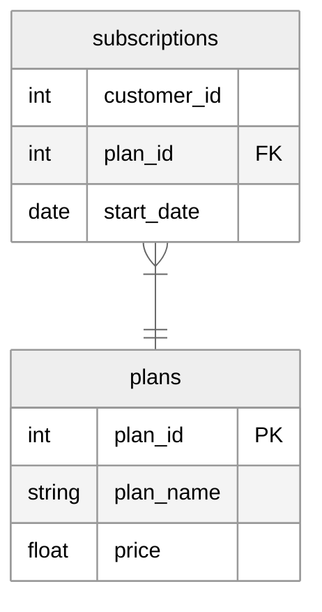

# Foodie-Fi

    

## Table of Contents

- [Context](#context)
- [Goals](#goals)
- [Data](#data)
- [Questions](#questions)

## Context

Danny found a few smart friends to launch his new startup Foodie-Fi in 2020. He started selling monthly and annual subscriptions giving their customers unlimited on-demand access to exclusive food videos from around the world - think something like Netflix but with only cooking shows!

## Goals

Danny created Foodie-Fi with a data-driven mindset. He wanted to ensure all future investment decisions and new features were decided using data. This case study focuses on using subscription-style data to answer important business questions.

## Data

### plans

Customers can choose which plans to join when they first sign up. 

Customers can sign up to a 7-day free trial. They will automatically continue with the pro monthly plan unless they cancel, downgrade to basic, or upgrade to the pro annual plan at any point during the trial.

When customers cancel their service, they will have a churn plan record with a NULL price.

| plan_id | plan_name     | price |
|---------|---------------|-------|
| 0       | trial         | 0     |
| 1       | basic monthly | 9.90  |
| 2       | pro monthly   | 19.90 |

### subscriptions

Customer subscriptions show the exact date where their specific plan starts. 

When customers upgrade a plan, the higher plan will take effect straightaway.

When customers downgrade a plan, the higher plan will remain in place until the period is over. The `start_date` will reflect the date that the actual plan changes. 

When customers churn, they will keep their access until the end of their current billing period, but the `start_date` will be the day they decided to cancel their service.

| customer_id | plan_id | start_date |
|-------------|---------|------------|
| 1           | 0       | 2020-08-01 |
| 1           | 1       | 2020-08-08 |
| 2           | 0       | 2020-09-20 |

## Questions

### A. Customer Journey

1. Based off the 8 sample customers (`customer_id` = [1, 2, 11, 13, 15, 16, 18, 19]), write a brief description about each customer’s onboarding journey.

### B. Data Analysis

1. How many customers has Foodie-Fi ever had?
2. What is the monthly distribution of trial plan `start_date` values? Use the start of the month as the group by value
3. What plan `start_date` values occur after 2020? Show the breakdown by count of events for each `plan_name`
4. What is the count and percentage of customers who have churned rounded to 1 decimal place?
5. How many customers have churned straight after their initial free trial? What percentage is this rounded to the nearest whole number?
6. What is the number and percentage of customers after their initial free trial?
7. What is the customer count and percentage breakdown of all 5 `plan_name` values as of 2020-12-31?
8. How many customers have upgraded to an annual plan in 2020?
9. How many days on average does it take for a customer to an annual plan from the day they joined Foodie-Fi?
10. Can you further breakdown this average value into 30 day periods (i.e. 0-29 days, 30-59 days)?
11. How many customers downgraded from a pro monthly to a basic monthly plan in 2020?

### C. Challenge Payment

1. The Foodie-Fi team wants you to create a new `payments` table for 2020 that includes amounts paid by each customer in the `subscriptions` table with the following requirements:
    - __REQ1:__ Monthly payments always occur on the same day of month as the original `start_date` of any monthly paid plan
    - __REQ2:__ Upgrades from basic plan to pro plans are reduced by the current paid amount in that month and start immediately
    - __REQ3:__ Upgrades from pro monthly to pro annual are paid at the end of the current billing period and also starts at the end of the month period
    - __REQ4:__ Once a customer churns, they will no longer make payments

Example outputs for this table might look like the following:

| customer_id | plan_id | plan_name     | payment_date | amount | payment_order |
|-------------|---------|---------------|--------------|--------|---------------|
| 16          | 1       | basic monthly | 2020-06-07   | 9.90   | 1             |
| 16          | 1       | basic monthly | 2020-07-07   | 9.90   | 2             |
| 16          | 1       | basic monthly | 2020-08-07   | 9.90   | 3             |
| 16          | 1       | basic monthly | 2020-09-07   | 9.90   | 4             |
| 16          | 1       | basic monthly | 2020-10-07   | 9.90   | 5             |
| 16          | 3       | pro annual    | 2020-10-21   | 189.10 | 6             |
| 19          | 2       | pro monthly   | 2020-06-29   | 19.90  | 1             |
| 19          | 2       | pro monthly   | 2020-07-29   | 19.90  | 2             |
| 19          | 3       | pro annual    | 2020-08-29   | 199.00 | 3             |

